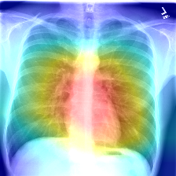

# CheXNet implementation in PyTorch

Yet another PyTorch implementation of the [CheXNet](https://arxiv.org/abs/1711.05225) algorithm for pathology detection in 
frontal chest X-ray images. This implementation is based on approach presented [here](https://github.com/arnoweng/CheXNet). Ten-crops 
technique is used to transform images at the testing stage to get better accuracy. 

The highest accuracy evaluated with AUROC was 0.8508 (see the model m-25012018-123527 in the models directory).
The same training (70%), validation (10%) and testing (20%) datasets were used as in [this](https://github.com/arnoweng/CheXNet) 
implementation.

## Prerequisites
* Python 3.5.2
* Pytorch
* OpenCV (for generating CAMs)

## Usage
* Download the ChestX-ray14 database from [here](https://nihcc.app.box.com/v/ChestXray-NIHCC/folder/37178474737)
* Unpack archives in separate directories (e.g. images_001.tar.gz into images_001)
* Run **python Main.py** to run test using the pre-trained model (m-25012018-123527)
* Use the **runTrain()** function in the **Main.py** to train a model from scratch

This implementation allows to conduct experiments with 3 different densenet architectures: densenet-121, densenet-169 and
densenet-201.

* To generate CAM of a test file run script HeatmapGenerator 

## Results
The highest accuracy 0.8508 was achieved by the model m-25012018-123527 (see the models directory).

| Pathology     | AUROC         |
| ------------- |:-------------:|
| Atelectasis   | 0.8321        |
| Cardiomegaly  | 0.9107        |
| Effusion      | 0.8860        |
| Infiltration  | 0.7145        |
| Mass          | 0.8653        |
| Nodule        | 0.8037        |
| Pneumonia     | 0.7655        |
| Pneumothorax  | 0.8857        |
| Consolidation | 0.8157        |
| Edema         | 0.9017        |
| Emphysema     | 0.9422        |
| Fibrosis      | 0.8523        |
| P.T.          | 0.7948        |
| Hernia        | 0.9416        |

## Computation time
The training was done using single Tesla P100 GPU and took approximately 22h.

